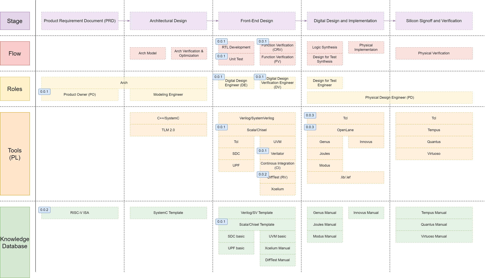

# LangChain VLSI Flow System

This is a LangChain-based VLSI flow system, with the ultimate goal of achieving text-to-GDSII conversion using the increasingly powerful capabilities of GPTs, in conjunction with existing open-source EDA tools.

The quality of GPT generated code in this project is ensured by TDD practices and knowledge database.

The flow system includes:

+ Roles
+ Development Flows
+ Tools and Programming Languages (PL)
+ Knowledge database

---

## Roles

+ Product Owner (PO): Responsible for overall project coordination and leading refinement meetings.
+ Architect: Responsible for analyzing and optimizing the required algorithm in a hardware-friendly manner and defining building blocks and their interfaces.
+ Design Engineer (DE): Responsible for writing RTL and unit tests.
+ Design Verification Engineer (DV): Responsible for functional verification.
+ More roles to be added in the future, such as Modeling Engineer, Physical Design Engineer, Design for Test Engineer, FPGA Engineer, etc.

### Architect

+ Analyze and optimize the required algorithm in a hardware-friendly manner
+ Clarify the goal of the optimization
+ Desice the hardware-software boundary
+ Define building blocks and their interfaces

### Product Owner (PO)

Responsibilities of the PO include:

+ Writing user stories
+ Writing acceptance criteria
+ Writing tasks
+ Writing Definition of Done (DoD)
+ Writing release notes
+ Writing user manuals
+ Writing design documents
+ Writing design review reports

### Digital Design Engineer (DE)

Responsibilities of the DE include:

+ Writing RTL and unit tests in a Test-Driven Development (TDD) manner
+ Writing unit test cases
+ Writing unit test plans
+ Writing unit test reports
+ Writing code review reports
+ Writing code review checklists
+ Writing code review meeting action items

### Digital Design Verification Engineer (DV)

Responsibilities of the DV include:

+ Writing functional verifications
+ Writing functional verification test cases
+ Writing functional verification test plans
+ Writing functional verification test reports

---
## Development Flows

### TDD Practices

+ Requirements review
+ Pair design
+ Design review
+ Test plan and test case review
+ Pair unit test development (coverage > 80%)
+ Pair programming
+ Code refactoring
+ Pair review
+ Functional verification
+ Regression test

### Meetings

+ Backlog Refinement Meeting: Refine tasks and Definition of Ready (DoR), Definition of Done (DoD), clarify requirements.
+ Sprint Planning Meeting: Discuss priorities and goals for the sprint. DoD, tasks, and acceptance criteria are finalized.
+ Sprint Retrospective Meeting: Review the sprint and write sprint retrospective reports.
+ Release Meeting: Review the release and write release reports.

---

## Tools and Programming Languages (PL)

+ Verilator
+ Google (with suggested websites)
+ Python 3, Chisel 5 (Scala), etc.

---

## Knowledge Database

+ Code templates
+ Flow checklists
+ Chisel doc and IPs.
+ IEEE standards
+ RISC-V ISA
+ Difftest doc
+ Cadence Tools doc (including ChipWare)